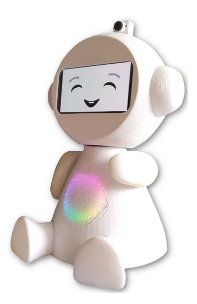

# Proposal for a new Software Architecture, extension of non-verbal communication capabilities, new 3D models and new version of the Simulator (EvaSIM) for the EVA robot, with the update and addition of new elements to the EvaML programming language #

In its initial (original) version, the EVA software architecture consisted of an application, developed in *NodeJS*, which provides a control interface through a Web application. This application basically contained a control interface for the robot elements (model WoZ) is a graphical tool for developing and executing scripts using a *Visual Programming Language* (VPL). For a new element, a new functionality, to be added as a first-class element to the EVA programming language, it was necessary to directly edit several source code files. The original proposal for the robot system did not offer a mechanism, an architecture, that would facilitate the addition of new functionalities, new sensors or actuators to the robot system.

## 1.  Software Architecture for EVA (New Proposal)
With the aim of allowing the extension of the robot's functionalities, facilitating the addition of new components to the EVA, this work presents the proposal for an architecture that uses a modular and distributed architecture model. All EVA functionalities, such as controlling **gaze expressions**, **LED animation**, **movement**, etc., are controlled by independent modules that are responsible for just one functionality, reducing coupling between modules. Control and communication between these modules is done through an **MQTT broker** using the *publish/subscribe* paradigm. In this new architecture, each control module, which implements a robot functionality, is an MQTT client that can publish and/or subscribe to topics by sending and receiving messages. These messages are used to pass parameters to the module or to return any result that has been generated by it. **Figure 1** shows an example of the robot's display control module, responsible for presenting the EVA's gaze expressions and which works as an MQTT client that subscribes to the EVA/display topic and can receive messages that determine the expression to be displayed by the robot. robot, such as: **HAPPY**, **SAD**, **ANGRY** and etc.

