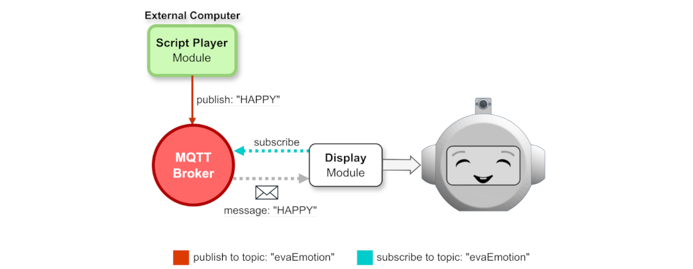
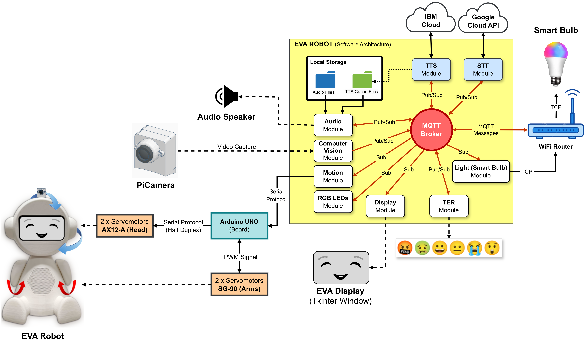

# Proposal for a new Software Architecture, extension of non-verbal communication capabilities, new 3D models and new version of the Simulator (EvaSIM) for the EVA robot, with the update and addition of new elements to the EvaML programming language #

In its initial (original) version, the EVA software architecture consisted of an application, developed in *NodeJS*, which provides a control interface through a Web application. This application basically contained a control interface for the robot elements (model WoZ) is a graphical tool for developing and executing scripts using a *Visual Programming Language* (VPL). For a new element, a new functionality, to be added as a first-class element to the EVA programming language, it was necessary to directly edit several source code files. The original proposal for the robot system did not offer a mechanism, an architecture, that would facilitate the addition of new functionalities, new sensors or actuators to the robot system.

  

## 1.  Software Architecture for EVA (New Proposal)
With the aim of allowing the extension of the robot's functionalities, facilitating the addition of new components to the EVA, this work presents the proposal for an architecture that uses a modular and distributed architecture model. All EVA functionalities, such as controlling **gaze expressions**, **LED animation**, **movement**, etc., are controlled by independent modules that are responsible for just one functionality, reducing coupling between modules. Control and communication between these modules is done through an **MQTT broker** using the *publish/subscribe* paradigm. In this new architecture, each control module, which implements a robot functionality, is an MQTT client that can publish and/or subscribe to topics by sending and receiving messages. These messages are used to pass parameters to the module or to return any result that has been generated by it. **Figure 1** shows an example of the robot's display control module, responsible for presenting the EVA's gaze expressions and which works as an MQTT client that subscribes to the EVA/display topic and can receive messages that determine the expression to be displayed by the robot. robot, such as: **HAPPY**, **SAD**, **ANGRY** and etc.

<strong>Figure 1.</strong> Control module responsible for representing the robot's emotions through its display. The module integrates into the system as an MQTT client that subscribes to the <em>EVA/display</em> topic.

  

The following image (**Figure 2**) shows an overview of the new EVA software architecture with all the modules responsible for its functionalities. All modules run inside the Raspberry Pi 4.

<strong>Figure 2.</strong> Overview of the new EVA software architecture.

 

## 1.2 Management of Control Modules (WebApp)
As presented, the robot system is made up of several modules, each one being responsible for a robot functionality, such as: controlling head movement, presenting expressions on the LCD display, controlling the smart lamp, etc. To have the robot system fully functioning, it is necessary to execute each of its modules in independent processes. To facilitate the process of executing and closing all modules at once, as well as individually, this work presents a small and lightweight Web application developed in Python using Flask. The application, which runs on Raspberry IP address and port 5000, provides an interface with buttons that allow you to start and stop the EVA control modules from any device that is connected to your network, such as a smart phone, for example. **Figure 3** shows the web application interface running on a smartphone.

<strong>Figure 3.</strong> Graphical user interface of the <strong>Web Application</strong> for managing EVA robot modules running on a smartphone.

