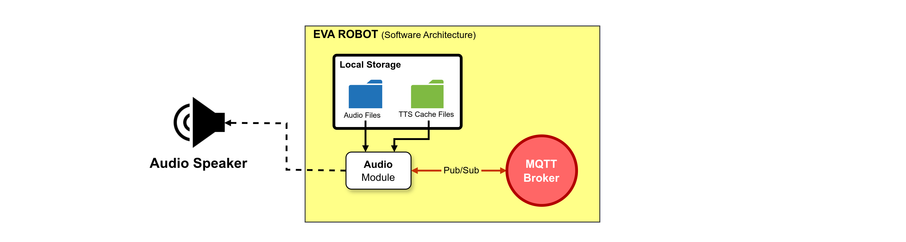
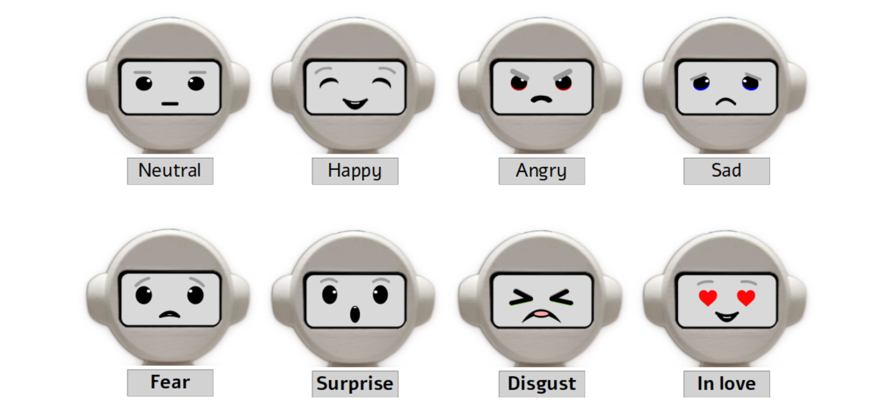

# EVA Display Module #

The EVA robot, in its original version, can express 4 emotions through its gaze using its display. These expressions are drawn using only the eyes as elements of the face. To draw these expressions, on the EVA screen, an animation made in the *Unity* software is used, which runs using a plugin within a Web browser and which is accessed through a local Web server. This approach has some limitations:

* Only 4 emotions can be expressed through the robot's gaze. These expressions can be seen in **Figure 1**. This limitation arises mainly due to the lack of more graphic elements that can be used in the process of representing EVA emotions, such as, for example, the mouth;

* The software infrastructure required to represent the robot's expressions on its display is heavy and complex, consuming more computational resources and adding greater complexity to the installation and configuration process of all its dependencies. This structure requires a Web browser and an HTTP server running locally. Saving resources is an important point, taking into account that the robot's control software runs on a *Raspberry Pi 4* with only 4GB of RAM.

<strong>Figure 1.</strong> The four expressions available in the first version of the EVA robot.

 

## 1. Extension of the EVA Robot's Non-Verbal Communication Capabilities (New Facial Expressions)

With the aim of improving the EVA open-source robotics platform, overcoming some of the aforementioned limitations, this work proposes an increase in the number of facial expressions of the robot using a lighter and simpler to install software structure. In this new version, the robot's display uses just one window, built using the Python *Tkinter* library, and the expression animation images are stored in a single animated GIF file. As previously mentioned, the only graphic elements used to create the robot's expressions, in its initial version, were the eyes, making it difficult, from an artistic point of view, to represent other expressions that depend on other elements of the face.

This work proposes a new design for the robot's expressions using, in addition to the eyes, the mouth, as a graphic element to represent the EVA's facial expression. Based on the model of emotions presented in the work of (**Ekman, 1992**), 6 expressions are proposed: **angry**, **happy**, **sad**, **fear**, **surprise** and **disgust**. In addition to these 6 emotions, there is also the expression of **neutrality**. In addition to these 7 expressions, which are based on real expressions, the expression **“in love”** was added. This is a fun expression, which aims to be used mainly in robot applications aimed at children. **Figure 2** presents the 8 proposed expressions.

<strong>Figure 2.</strong> New expressions with a new design for the EVA robot.

 

## Module Dependencies

* **Paho-Mqtt 1.6.1** (It can be installed using pip)
* **sudo apt install flac**

